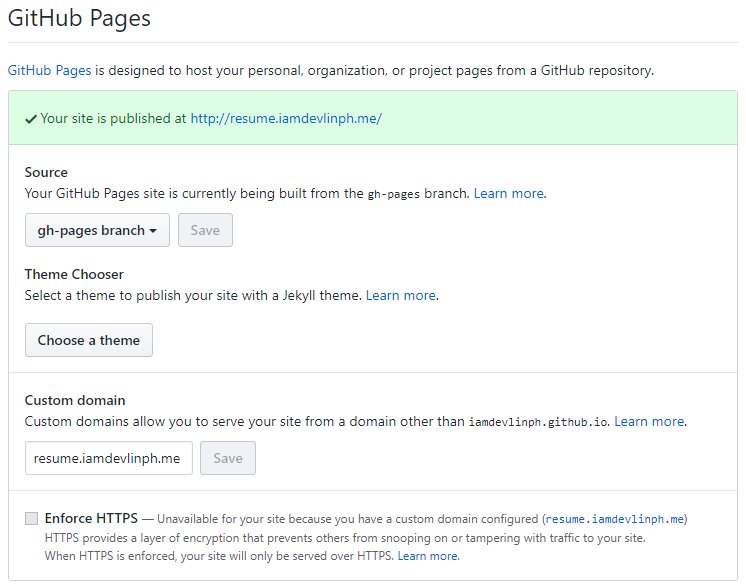
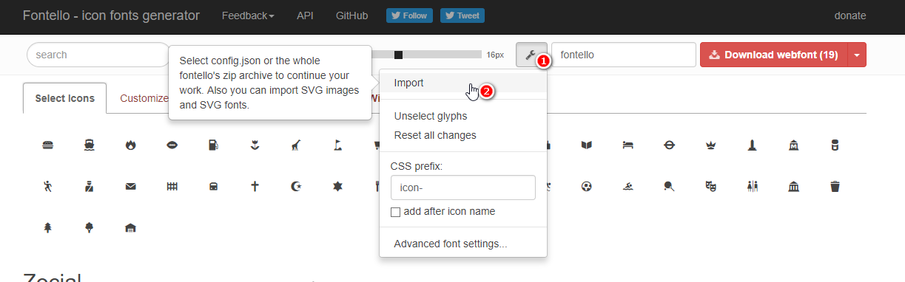

# Resume v2
This is a rewrite of the resume template using new stuff I learned along the way.

#### React Pkg

[![npm version][npm-img]][npm-url]
[![node version][node-img]][node-url]
[![deps][deps-img]][deps-url]

#### Resume Repository Details

[![open issues][issues-img]][issues-url]
[![open prs][pr-img]][pr-url]

[![contributors][contributor-img]][contributor-url]

This uses the [React Kit](https://github.com/codesandcoffees/react-kit) as the base template which is based on [Create React App](https://github.com/facebook/create-react-app)

# Includes
- [React](https://github.com/facebook/react)
- [Redux](https://github.com/reactjs/redux)
- [redux-saga](https://github.com/redux-saga/redux-saga)
- [React Loadable](https://github.com/jamiebuilds/react-loadable)
- [React Router](https://github.com/ReactTraining/react-router)
- [Webpack](https://github.com/webpack/webpack)
- Ducks Pattern ["Official Proposal"](https://github.com/erikras/ducks-modular-redux)
- [styled-components](https://github.com/styled-components/styled-components)
- [lint-staged](https://github.com/okonet/lint-staged) for pre-commit hooks
- CSS Grid

# App Structure
```
resume/
  .vscode/
  build/
  config/
  public/
  scripts/
  src/
  --components/
  --containers
  --ducks/
  --routes/
  --sagas/
  --services/
  --App.js
  --index.js
  --registerServiceWorker.js
  --store.js
  package.json
  README.md
```

# Getting Started
At the time of writing this, the following versions were used
```
node -v 8.11.1
npm -v 5.8.0
```
1. Clone the repository
```
git clone git@github.com:iamdevlinph/resume.git resume
```
2. Go into the directory
```
cd resume
```
3. Install the packages
```
npm run install
```

# Development
To start development server and access the site at [localhost:3000/](localhost:3000/)
```
npm run start
```

And if you only want to build the files
```
npm run build-only
```

# Deployment
The deployment process in this app only supports github pages using the `gh-pages` branch. To set it up:
1. Make necessary changes to your repository's settings.

Change the `source` to `gh-pages branch`.

If you have your own domain. Input your `custom domain` if you have and don't forget to add a `CNAME` file in the `public` folder. This will handle the redirecting from `github pages` to your custom domain.



2. In the `package.json` change the `homepage` property with the url where the app will be accessed
```
// for github pages domain
"homepage": "https://<username>.github.io/<repository_name>"

// for custom domains just put your own domain
"homepage": "<your_custom_domain_here>"
```
3. After setting up the correct url for `homepage` you can now deploy using
```
npm run deploy
```
This will build the files and deploy them to the `gh-pages` branch

4. Access your app with the url you used in the `homepage` property.

# Font and Icons
The font used in this project is just the [Open Sans](https://fonts.google.com/specimen/Open+Sans) from `Google Fonts`

[Fontello](http://fontello.com/) is used to manage the icons. Fontello uses the icons from different icon makers like `Font Awesome` and others.

Fontello allows us to only use the icons that we actually use, so it might look the icon selection in this project is very limited but we can expand it by adding the icons that are needed.

### Downloading icons
1. Go to [fontello](http://fontello.com/)
2. Import `public/fonts/fontello.config.json`. This contains the already selected icons in the project

3. This will pre-select the icons that are already included in the `config.json` file
4. Click on the icons that you want to add
5. Click `Download webfont` once you're done. This will download the `font files` and the `config.json` file
6. Replace the files found in the `public/fonts/` with the newly downloaded ones

### Adding the icons
Once you've downloaded the files they won't be automatically added to the css so we'd have to do this manually.
1. Open `fontello.svg`
2. Find the line of the icon you want to add. Let's take the icon `folder-open` as an example
```
<glyph glyph-name="folder-open" unicode="&#xe800;"
```
3. In the `unicode`. Copy the code after the `x` like `&#xe800` to `e800`
4. Open `public/fonts/fontello.css`
5. Add a new class like so  (I chose `icon-` as the prefix)
```
.icon-folder-open:before {content: '\e800'; }
```
6. And use the icon like so
```
<i className="icon-folder-open" />
```

A bit of a hassle, yes. But we'll end up with the icons that we actually use.

# Took inspiration from
- [Split Resume Template](http://demo.mutationmedia.net/SPLIT/)
- [Material CV/Resume Template](http://demo.deviserweb.com/cv/)
- [Responsive Timeline CSS](https://codepen.io/brady_wright/pen/NNOvrW)
- [Github Fork Ribbon CSS](https://github.com/simonwhitaker/github-fork-ribbon-css)

# Something to pitch in?

Feel free to open up a [pull request](https://github.com/iamdevlinph/resume/pulls) or an [issue](https://github.com/iamdevlinph/resume/issues/new)

---

This project was bootstrapped with [Create React App](https://github.com/facebookincubator/create-react-app).

Read the original [README.md](/README-orig.md)

<!-- React PKG -->
[npm-img]: https://img.shields.io/npm/v/@codes-and-coffees/react-pkg.svg?style=flat-square&maxAge=86400
[npm-url]: https://www.npmjs.com/package/@codes-and-coffees/react-pkg
[node-img]: https://img.shields.io/node/v/@codes-and-coffees/react-pkg.svg?style=flat-square&maxAge=86400
[node-url]: https://nodejs.org/en/
[deps-img]: https://img.shields.io/david/codesandcoffees/react-pkg.svg?style=flat-square&maxAge=86400
[deps-url]: https://david-dm.org/codesandcoffees/react-pkg

<!-- React Kit -->
[issues-url]: https://github.com/iamdevlinph/resume/issues
[issues-img]: https://img.shields.io/github/issues/iamdevlinph/resume.svg?style=flat-square&maxAge=86400
[pr-img]: https://img.shields.io/github/issues-pr/iamdevlinph/resume.svg?style=flat-square&maxAge=86400
[pr-url]: https://github.com/iamdevlinph/resume/pulls
[contributor-img]: https://img.shields.io/github/contributors/iamdevlinph/resume.svg?style=flat-square&maxAge=86400
[contributor-url]: https://github.com/iamdevlinph/resume/graphs/contributors
